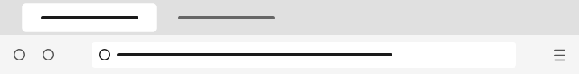
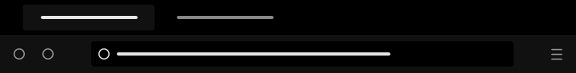

# Octo Firefox

Thème Firefox épuré avec basculement automatique clair/foncé.




## Ce que ça fait

Ce thème applique une palette monochrome à l'interface de Firefox, barres d'outils, onglets, popups et sidebar. Le thème s'adapte automatiquement au mode système : clair le jour, foncé la nuit.

## Installation

### Depuis Firefox Add-ons

Installe directement depuis [addons.mozilla.org](https://addons.mozilla.org/en-US/firefox/addon/octo-theme/).

## Développement

```bash
# Charger le thème temporairement pour le tester
# Dans Firefox, ouvre about:debugging → Ce Firefox → Charger un module temporaire
# Sélectionne le fichier manifest.json
```

Pour générer le `.xpi` (archive ZIP renommée) :

```bash
zip -r octo-theme.xpi manifest.json icons/
```
