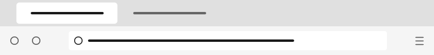
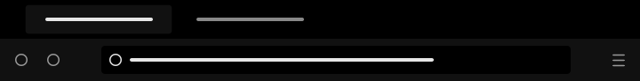

# Octo Firefox

Thème Firefox et Thunderbird épuré avec basculement automatique clair/foncé.




## Ce que ça fait

Ce thème applique une palette monochrome à l'interface de Firefox, barres d'outils, onglets, popups et sidebar. Le thème s'adapte automatiquement au mode système : clair le jour, foncé la nuit.

Dans Thunderbird, il couvre aussi le courrier, le calendrier, le volet Aujourd'hui, le carnet d'adresses et la fenêtre de rédaction, avec un accent bleu pour la sélection et les boutons principaux. Le contenu HTML des courriels garde ses propres couleurs.

## Installation

### Depuis Firefox Add-ons

Installe directement depuis [addons.mozilla.org](https://addons.mozilla.org/en-US/firefox/addon/octo-theme/).

### Thunderbird

Installe `octo-theme-thunderbird.xpi` depuis [addons.thunderbird.net](https://addons.thunderbird.net), ou depuis le fichier : Modules complémentaires et thèmes → roue dentée → Installer un module depuis un fichier.

## Développement

Firefox refuse les thèmes qui utilisent `theme_experiment`, nécessaire pour Thunderbird. Chaque application a donc son propre manifest :

- `manifest.json` : Firefox
- `thunderbird/manifest.json` et `thunderbird/octo.css` : Thunderbird

```bash
# Charger le thème temporairement pour le tester
# Firefox : about:debugging → Ce Firefox → Charger un module temporaire → manifest.json
# Thunderbird : Modules complémentaires et thèmes → roue dentée → Déboguer des modules
#               → Charger un module temporaire → thunderbird/manifest.json
```

Pour générer les `.xpi` (archives ZIP renommées) :

```bash
./build.sh
```
